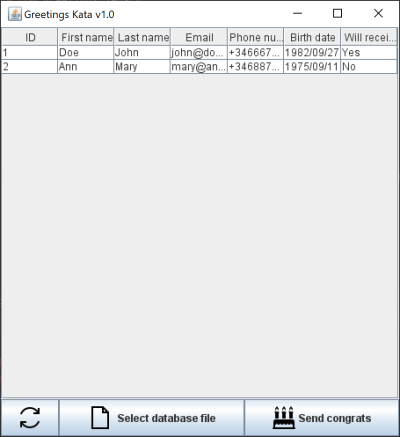

# TheBirthdayGreetings-Kata
Kata about Hexagonal Architecture (also known as Ports & Adapters) written in Kotlin. It is an adaptation of the <a href="https://github.com/xpmatteo/birthday-greetings-kata">original</a>, whose author is Matteo Vaccari

## ✨ Getting started
In this kata we will refactor a tightly coupled, hard to understand, not open to change and not test friendly codebase, apliying Hexagonal Architecture.

Before starting the kata you should inform yourself about hexagonal architecture through the resources that you will find below.

## 💡 What does the app do?

The core functionality of this application is to congratulate the company's employees on their birthday.



Employee data is read from a flat file, employees whose birthday is today are filtered and the application sends them a congratulations message by email.

The flat file is a sequence of records, separated by newlines; this is the format:

```
Doe, John, 1982/10/08, john.doe@foobar.com,+34666777111
Ann, Mary, 1975/09/11, mary.ann@foobar.com,+34688777111
```

The greetings message contains the following:

    Subject: 	Happy birthday!
    Body: 		Happy birthday, dear X!

with the first name of the employee substituted for "X"

## 😟 What is the problem?

When it was created, the application **was made as a (old fashioned) Swing desktop application**, but now the business team has asked to **create a web version**, in addition, greeting **messages in the web version** must be sent **via SMS**.

The application needs to be completely refactored to support these new requirements since business logic is mixed with the rest of the app code.

**You can find the app code inside *legacy-codebase* module of this project.**

## 🏁 What do I have to do?

The objective is to **isolate the core of the application** and thus be able to share it between the two platforms (web & desktop), **applying hexagonal architecture**. Also, tests of all application components must be performed (you can follow TDD).

**You can use any third-party service or framework** you know to implement the application adapters. **You can even ignore them**, as you already know, in hexagonal architecture you can leave those decisions open 😜

## 🎁 A possible solution

🚧 Under construction 🚧


## 🧰 Useful resources

 - [Hexagonal architecture](https://web.archive.org/web/20180121161736/http://alistair.cockburn.us/Hexagonal+architecture) by _Alistair cockburn_

 - [Ports and Adapters Pattern (Hexagonal Architecture)](https://softwarecampament.wordpress.com/portsadapters/) by _Juan Manuel Garrido de Paz_

 - [Decoupling your technical code from your business logic with Hexagonal Arch.](https://beyondxscratch.com/2017/08/19/decoupling-your-technical-code-from-your-business-logic-with-the-hexagonal-architecture-hexarch/) by _Julien Topçu_

 - [Get your hands dirty with Clean Architecture (Book)](https://reflectoring.io/get-your-hands-dirty-on-clean-architecture/) by _Tom Hombergs_

# License
This repository is an adaptation of the <a href="https://github.com/xpmatteo/birthday-greetings-kata">original</a>, whose author is Matteo Vaccari

  <a rel="license" href="http://creativecommons.org/licenses/by-nc-sa/2.5/it/"></a><br />This work is licensed under a <a rel="license" href="http://creativecommons.org/licenses/by-nc-sa/2.5/it/">Creative Commons Attribution-NonCommercial-ShareAlike 2.5 Italy License</a>.
</p>
